# "Wait & Decide" Strategy for Kiro Attribution

## Context
When Kiro IDE generates code, it writes to two places:
1. The **File System** (Target file).
2. The **Log File** (`Kiro Logs.log`).

**Problem**: The File System change event (detected by VS Code watcher) often fires **10-100ms BEFORE** the Log File updated event.
This caused a Race Condition where `git-ai-tracking` would check logs synchronously, find no AI signal, and incorrectly attribute the change to "Human".

## Solution: "Wait & Decide" Strategy

To ensure 100% accuracy, we implemented a synchronized delay mechanism across the stack.

### 1. Frontend: VS Code Extension
**File**: `src/checkpointManager.ts`

When a file is saved:
1.  **Synchronous Check**: Immediate check for AI signal. If found -> **AI Checkpoint**.
2.  **Wait State**: If not found, do NOT commit as Human immediately. Enter "Wait State".
3.  **Timer (1000ms)**: Start a 1000ms timer.
    *   During wait: If `signalAiActivity` (polling) detects a signal -> **Cancel Timer** -> **AI Checkpoint**.
    *   Timer Expires: If still no signal -> **Human Checkpoint**.

### 2. Backend: Git AI (Rust)
**File**: `git-ai-extend/src/commands/hooks/commit_hooks.rs`

When a user manually runs `git commit`:
*   **Pre-commit Hook Delay**: The hook sleeps for **1000ms** before proceeding.
*   **Reason**: If a user saves (triggering VS Code wait) and immediately types `git commit`, the backend must wait for VS Code to finish its decision process and send the checkpoint data. Without this, the backend would see no checkpoint and default to Human.

## Flow Diagram

```mermaid
sequenceDiagram
    participant U as User/Kiro
    participant FS as File System
    participant Ext as VS Code Extension
    participant Backend as Git AI (Rust)

    Note over U, FS: File Save Event
    U->>FS: Writes File (Save)
    FS->>Ext: File Change Event
    Ext->>Ext: Sync Check (No Signal?)
    
    rect rgb(60, 60, 60)
    Note over Ext, Backend: START WAIT (1000ms)
    
    par Parallel Execution
        U->>Backend: git commit (Manual)
        Note right of Backend: Backend sleeps 1000ms
        Backend->>Backend: Sleep 1000ms
    and AI Signal Arrives (Delayed)
        U->>FS: Kiro Log Updated
        FS->>Ext: Log Change Detected
        Ext->>Ext: Cancel Timer
        Ext->>Ext: EXECUTE AI CHECKPOINT
    end
    end
    
    Note over Backend: Wake up after 1s
    Backend->>Backend: Check DB for Checkpoint
    Backend-->>U: Commit with Correct Attribution (AI)
```

## Scenarios

| Scenario | Before (Fixed) | With "Wait & Decide" |
|----------|---------------|----------------------|
| **Kiro writes file, Log delayed 100ms** | Extension sees NO signal -> **Human** (Wrong) | Extension waits -> Sees signal at 100ms -> **AI** (Correct) |
| **Kiro writes file, Log delayed 800ms** | Extension sees NO signal -> **Human** (Wrong) | Extension waits -> Sees signal at 800ms -> **AI** (Correct) |
| **User writes file (True Human)** | Extension sees NO signal -> **Human** | Extension waits 1s -> Still NO signal -> **Human** (Correct) |
| **User saves & immediately commits** | Backend sees no checkpoint -> **Human** | Backend sleeps 1s -> Extension sends checkpoint -> **Human/AI** (Correct) |
