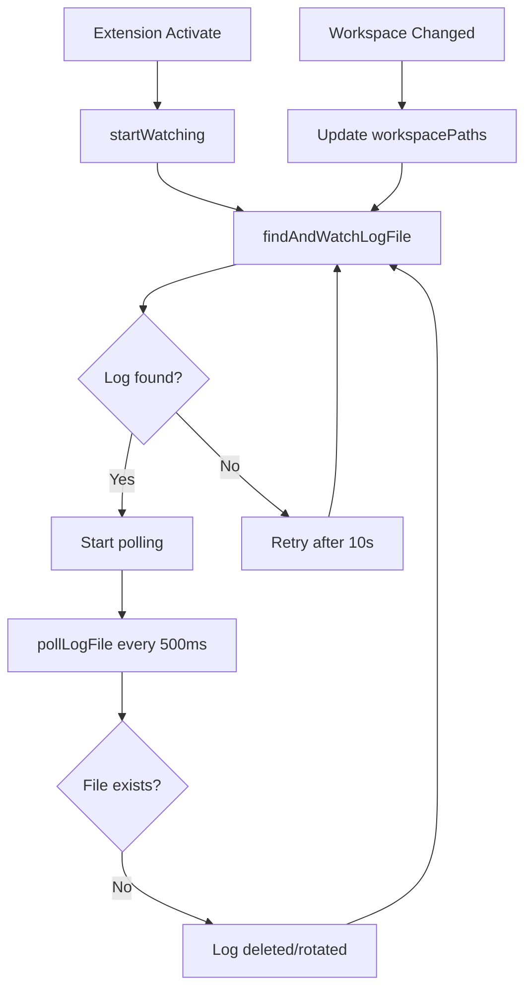

# Flow Chi Tiết: Kiro Window Detection

## Cấu Trúc Log Kiro (Đầy đủ)

```
~/Library/Application Support/Kiro/logs/
└── 20260129T092855/                              # Session (theo thời gian start Kiro)
    ├── window1/
    │   ├── exthost/
    │   │   ├── exthost.log                       ← "Extension host with pid 16092 started"
    │   │   └── kiro.kiroAgent/
    │   │       └── Kiro Logs.log                 ← Chứa [WriteFile] signals
    │   └── renderer.log
    │
    ├── window2/
    │   ├── exthost/
    │   │   ├── exthost.log                       ← "Extension host with pid 16091 started"
    │   │   └── kiro.kiroAgent/
    │   │       └── Kiro Logs.log
    │   └── renderer.log
    │
    └── window3/
        └── ...
```

> **Lưu ý**: window1, window2, window3... là các thư mục **NGANG HÀNG** (sibling), không phải lồng nhau.

---

## Khi Nào findLogFile() Được Trigger?

`findLogFile()` được gọi trong các trường hợp sau:

| # | Event | Trigger | Mô tả |
|---|-------|---------|-------|
| 1 | **Extension startup** | `startWatching()` | Khi extension activate, gọi `findAndWatchLogFile()` để tìm log file lần đầu |
| 2 | **Log not found retry** | Timer 10s | Nếu không tìm thấy log, retry sau 10 giây |
| 3 | **Log file deleted** | `pollLogFile()` | Khi poll thấy log file không còn tồn tại (Kiro restart) → re-find |
| 4 | **Workspace changed** | `onDidChangeWorkspaceFolders` | User thêm/xóa folder → update workspacePaths và re-find |



---

## PID Lifecycle (Quan trọng!)

### PID là gì trong context này?

**PID = Process ID của Extension Host** - process chạy tất cả extensions trong 1 Kiro window.

### Khi nào PID được sinh ra?

```
User mở Kiro window
    ↓
Kiro spawn Extension Host process
    ↓
PID được assign (e.g., 16092)
    ↓
exthost.log ghi: "Extension host with pid 16092 started"
    ↓
PID KHÔNG ĐỔI suốt lifetime của window
```

### PID có thay đổi không?

| Hành động | PID thay đổi? |
|-----------|---------------|
| User switch chat session | ❌ Không |
| User tạo chat session mới | ❌ Không |
| User restore session cũ | ❌ Không |
| User đổi workspace folder | ❌ Không |
| User **đóng và mở lại** Kiro window | ✅ PID mới |
| User **restart** Kiro | ✅ PID mới |

### PID vs Chat Session ID

```
PID = 16092 (per window, stable)
    └── Chat Session IDs (per conversation, nhiều sessions trong 1 window):
        ├── b8b6fd2fc1b4931bd4160573e065f395.chat
        ├── 3f52d4a8614b45f450e7db301456db7e.chat
        └── 5ddd4e6daf235684bc208b18e743dd09.chat
```

**Kết luận**: 
- PID là **stable identifier** cho mỗi Kiro window
- Chat Session ID là identifier cho mỗi cuộc hội thoại
- Extension dùng **PID** để identify window, **KHÔNG** dùng chat session ID

---

## Logic Match Chi Tiết

> **Câu hỏi**: "Tại sao biết để tìm file.js?"

**Trả lời**: Extension KHÔNG cần biết trước file cụ thể. Logic hoạt động như sau:

```
1. Extension biết workspacePaths = ["/Users/phuc/project-a"]
   (lấy từ vscode.workspace.workspaceFolders)

2. Khi findLogFile() chạy, nó SCAN TẤT CẢ WINDOWS:
   ┌─────────────────────────────────────────────────────────────┐
   │ for each windowDir in [window1, window2, window3, ...]:    │
   │   logPath = windowDir/exthost/kiro.kiroAgent/Kiro Logs.log │
   │   if logMatchesWorkspace(logPath):                         │
   │       return logPath  ← CHỌN LOG NÀY                       │
   └─────────────────────────────────────────────────────────────┘
   
   logMatchesWorkspace() đọc 50KB cuối của log file:
   - Tìm TẤT CẢ entries có pattern [WriteFile] complete write file: <path>
   - Check: path.startsWith(workspacePath) ?

3. Ví dụ cụ thể:
   
   Extension đang chạy trong Window1, workspace = /Users/phuc/project-a
   
   Scan window1/Kiro Logs.log:
     Chứa: [WriteFile] /Users/phuc/project-a/file.js
     Check: "/Users/phuc/project-a/file.js".startsWith("/Users/phuc/project-a")
     → TRUE ✓ → CHỌN log này!
     
   (Không cần scan tiếp window2, window3...)
```

**Kết luận**: Extension scan TẤT CẢ log files của tất cả windows, chọn cái có WriteFile path match workspace.

---

## Xử Lý Từng Trường Hợp

### Trường hợp 1: User mở nhiều Kiro window

**Tình huống chi tiết**: 
- Window1: mở `/Users/phuc/project-a`, user **dùng AI sửa** `main.js`
- Window2: mở `/Users/phuc/project-b`, user **tự tay sửa** `app.py`

**Timeline thực tế**:
```
T=0s:  User yêu cầu Kiro AI trong Window1 sửa main.js
T=1s:  Kiro AI ghi file → window1/Kiro Logs.log:
       "[WriteFile] complete write file: /Users/phuc/project-a/main.js"
       
T=2s:  User mở Window2 và tự tay sửa app.py (KHÔNG qua AI)
       → KHÔNG có [WriteFile] nào được ghi
       
T=3s:  User save app.py trong Window2
       → FileSystemWatcher trigger → checkpoint HUMAN (đúng!)
       
T=4s:  User save main.js trong Window1  
       → FileSystemWatcher trigger → extension check log
```

**Xử lý matching**:
```
Extension trong Window1 (kiểm tra lúc T=4s):
  workspacePaths = ["/Users/phuc/project-a"]
  
  findLogFile():
    Scan window1/Kiro Logs.log:
      Found: [WriteFile] /Users/phuc/project-a/main.js
      Check: "/Users/phuc/project-a/main.js".startsWith("/Users/phuc/project-a")
      → TRUE! MATCH ✓
    
    → Chọn window1 log → Poll nó → Phát hiện AI signal → checkpoint AI
```

**Kết quả**: 
- ✅ Window1: AI edit → checkpoint AI
- ✅ Window2: Human edit (không có WriteFile) → checkpoint Human

---

### Trường hợp 2: User mở session chat mới ở 1 window

**Tình huống chi tiết**: 
- Window1: đang chat với Kiro, đã AI sửa `file1.js`
- User tạo chat session mới, yêu cầu AI sửa `file2.js`

**Log trước và sau**:
```
TRƯỚC (session cũ):
  [WriteFile] complete write file: /project/file1.js

SAU (session mới):  
  [WriteFile] complete write file: /project/file1.js
  [WriteFile] complete write file: /project/file2.js   ← THÊM MỚI
```

**Xử lý**: Cùng window = cùng log directory. Các WriteFile mới được APPEND vào cùng file.

**Kết quả**: ✅ Hoạt động bình thường, không ảnh hưởng.

---

### Trường hợp 3: User sửa song song trên nhiều Kiro window

**Tình huống chi tiết**:
- Window1 (project-a): User yêu cầu AI sửa `api.js` và `utils.js`
- Window2 (project-b): User yêu cầu AI sửa `server.py`
- Cả hai xảy ra gần như cùng lúc

**Timeline**:
```
T=0ms:   Window1: AI bắt đầu sửa api.js
T=50ms:  Window2: AI bắt đầu sửa server.py  
T=100ms: Window1: AI hoàn thành → log: [WriteFile] .../project-a/api.js
T=120ms: Window2: AI hoàn thành → log: [WriteFile] .../project-b/server.py
T=150ms: Window1: AI tiếp tục sửa utils.js
T=200ms: Window1: AI hoàn thành → log: [WriteFile] .../project-a/utils.js
```

**Extension-1 (trong Window1) poll tại T=250ms**:
```
Đọc window1/Kiro Logs.log:
  [WriteFile] /project-a/api.js   → match /project-a ✓
  [WriteFile] /project-a/utils.js → match /project-a ✓
  
→ Tất cả AI signals cho project-a được bắt
```

**Extension-2 (trong Window2) poll tại T=250ms**:
```
Đọc window2/Kiro Logs.log:
  [WriteFile] /project-b/server.py → match /project-b ✓
  
→ AI signal cho project-b được bắt
```

**Kết quả**: ✅ Không conflict, mỗi extension độc lập.

---

### Edge Case: User restore/switch session chat cũ

**Tình huống**: 
- User đang chat session B
- User click vào session A cũ để xem lại hoặc tiếp tục

**Phân tích**:
```
Session chat chỉ là UI state - lưu trong KiroLLMLogs.log (transcript)
WriteFile signals vẫn ghi vào Kiro Logs.log như bình thường

Nếu user TIẾP TỤC edit từ session cũ:
  → Kiro AI vẫn ghi [WriteFile] vào cùng log file
  → Extension vẫn detect bình thường
```

**Tại sao không ảnh hưởng?**
1. `Kiro Logs.log` là append-only, không bị reset khi switch session
2. Pattern `[WriteFile]` được ghi bất kể session nào active
3. Extension match theo workspace path, không theo session ID

**Kết quả**: ✅ Hoạt động bình thường.

---

### Edge Case: Workspace thay đổi giữa session

**Tình huống**: User đóng folder A và mở folder B trong cùng window.

**Xử lý với listener**:
```typescript
vscode.workspace.onDidChangeWorkspaceFolders(() => {
    // Cập nhật danh sách workspace paths
    this.workspacePaths = (vscode.workspace.workspaceFolders ?? [])
        .map(f => f.uri.fsPath);
    
    // Re-find log file phù hợp với workspace mới
    this.stopWatching();
    this.findAndWatchLogFile();
});
```

**Kết quả**: ✅ Listener sẽ tự động cập nhật.

---

### Edge Case: Cùng project trong 2 windows khác nhau

**Tình huống**: 
- Window1: mở `/Users/phuc/project-a`
- Window2: cũng mở `/Users/phuc/project-a`
- User dùng AI trong Window2 để sửa file

**Vấn đề với workspace matching**:
```
Extension trong Window2 scan:
  window1/Kiro Logs.log → có WriteFile .../project-a/old.js → MATCH ✓ (từ trước)
  window2/Kiro Logs.log → có WriteFile .../project-a/new.js → MATCH ✓
  
  → Có thể chọn window1 (scan trước) → SAI!
```

**Giải pháp: PID-based matching**

Mỗi extension host có PID riêng, được ghi trong `exthost.log`:
```
window1/exthost/exthost.log: "Extension host with pid 16092 started"
window2/exthost/exthost.log: "Extension host with pid 16091 started"
```

Extension có thể dùng `process.pid` để match:
```typescript
const myPid = process.pid.toString();  // e.g., "16091"

for (windowDir of [window1, window2, ...]) {
    exthostLog = windowDir/exthost/exthost.log
    if (exthostLog contains `pid ${myPid}`) {
        → ĐÂY LÀ WINDOW CỦA TÔI!
    }
}
```

**Kết quả**: ✅ 100% chính xác, ngay cả khi cùng project trong nhiều windows.

---

## Tóm Tắt So Sánh

| Trường hợp | Cách cũ (mtime) | Cách mới (PID + workspace) |
|------------|-----------------|---------------------------|
| Multi-window | ❌ Có thể sai | ✅ Luôn đúng |
| Session mới | ⚠️ Có thể sai | ✅ Không ảnh hưởng |
| Song song edit | ❌ Race condition | ✅ Độc lập |
| Multi-root | ❌ Không áp dụng | ✅ Check tất cả paths |
| First edit | ✅ Fallback OK | ✅ Synchronous check |
| Workspace change | ❌ Stuck | ✅ Listener xử lý |
| Session restore | - | ✅ Không ảnh hưởng |
| **Same project 2 windows** | ❌ Sai | ✅ PID match |
